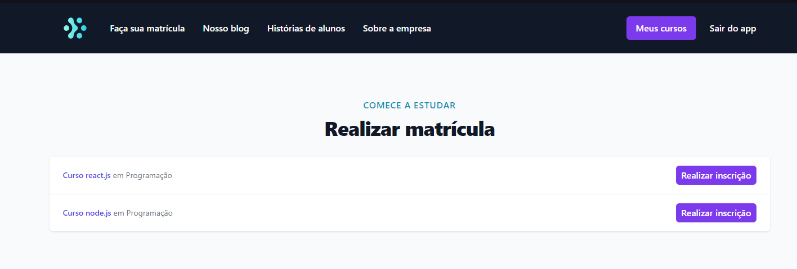
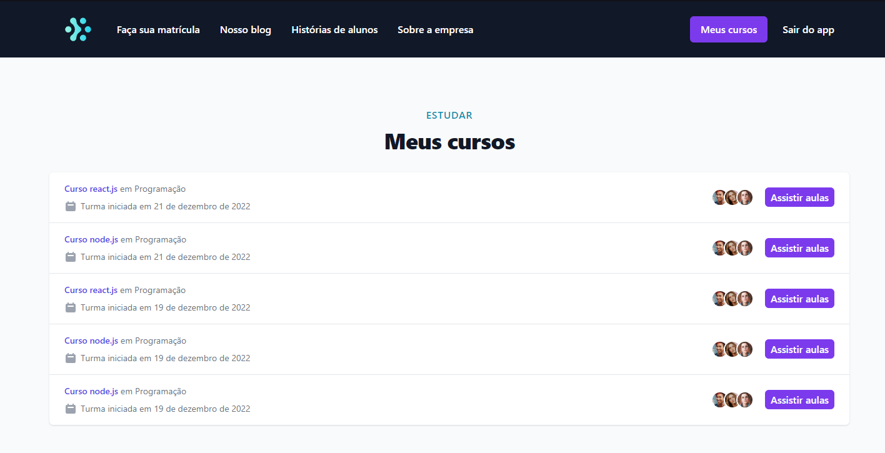

# Ignite lab

### **Sobre**

Com uma série de 5 aulas ministrado pelo Diego Fernandes da Rocketseat, foi desenvolvido um aplicativo micro-serviço para cadastro e compras de curso.
Micro serviço é uma forma de construir aplicações grandes, fazendo com que um serviço não dependa do outro diretamente para funcionar.

Pude aprender desde o inicio como funciona e na prática a construção de um aplicativo completo.

### **Serviços**
- Serviço de Classroom foi feito para o usuário ter acesso a dados sobre os cursos na qual faz parte.

- Serviço de Purchase foi feito para o usuário ter acesso aos produtos do aplicativo, como poder comprar um novo curso.

### **Tecnologias utilizadas**

Para o backend em **Node.JS** nos serviços de Classroom e Purchase, foram utilidados as seguintes tecnologias:
  - NestJs
  - Graphql
  - Kafka
  - Prisma
  - Typescript

-> Para fazer a conexão entre os micro-serviços e oferecer uma URL de api única, foi utilidado o Gateway.

Para o frontend em **Next.JS**, foi utilizado as seguintes tecnologias:
  - Graphql
  - Apollo/client
  - Tailwind CSS
  - Codegen

___

### Frontend funcionando

  
  <small>Página de realizar matrícula listando dados do serviço de Purchase</small>

  ___

  
  <small>Página listando dados dos cursos na qual o usuário faz parte do serviço de Classroom</small>

